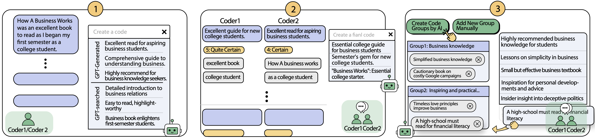

 

<br/>

[](https://opensource.org/licenses/MIT)
[](https://www.javascript.com/)
[](https://www.python.org/)
[](https://nodejs.org/en/)
[](https://reactjs.org/)
[](https://expressjs.com/)
[](https://github.com/gaojie058/CollabCoder-Project)


**CollabCoder** is a one-stop, end-to-end **Collaborative Qualitative Analysis (CQA)** workflow that integrates **Large Language Models (LLMs)** into key _inductive_ CQA stages aligned with the standard CQA process, aiming to lower the bar for adhering to a strict CQA procedure.

## 🐱‍💻 Preview

😊 As CollabCoder is a web application that requires collaboration between two people, we currently lack the resources to support this application. However, we are providing a [sample demo](http://16.16.202.78/Demouser/demo/edit/Demouser) for you to try! In the "Installation" section, we provide specific steps to **install**, **run** and **use** it on your computer. 

🚀 Here is a video that introduces CollabCoder's motivation and demostration: [CollabCoder's Motivation and Demo (YouTube)](https://youtu.be/C3n4UvMHgIY)


## ⭐ Features
**CollabCoder** includes three-phase interfaces: **independent open coding**, **iterative discussions**, and **final codebook creation**.
-   In **independent open coding** (figure 1), CollabCoder offers GPT-generated code suggestions on demand and records decision-making data (e.g. keywords and certainty) as support for their code.
-   During **iterative discussions** (figure 2), CollabCoder promotes mutual understanding by sharing coding decision-making data within the coding team and using quantitative metrics to identify coding agreements and disagreements, aiding in consensus-building.
-   In **final codebook creation** (figure 3), CollabCoder provides primary code group suggestions, lightening the cognitive load of finalizing the codebook.



## 📚 Directory

- [🐱‍💻 Preview](#-preview)
- [⭐ Features](#-features)
- [📚 Directory](#-directory)
- [🔨 Installation](#-installation)
  - [1. 🌱 Prerequisites](#1--prerequisites)
    - [1.1 Install node.js](#11-install-nodejs)
    - [1.2 Set up Python environment](#12-set-up-python-environment)
    - [1.3 Create a cloud database](#13-create-a-cloud-database)
    - [1.4 Get an OpenAI API key](#14-get-an-openai-api-key)
  - [2. ⬇️ Get CollabCoder Source Code](#2-️-get-collabcoder-source-code)
    - [2.1 Clone the repository](#21-clone-the-repository)
    - [2.2 Install frontend dependencies](#22-install-frontend-dependencies)
    - [2.3 Install backend dependencies](#23-install-backend-dependencies)
  - [3. ⚙️ Environment: Add .env to backend](#3-️-environment-add-env-to-backend)
- [🚀 Running](#-running)
  - [Run the backend](#run-the-backend)
  - [Run the frontend](#run-the-frontend)
- [📦 Building](#-building)
- [📖 Related Papers](#-related-papers)
- [🙋‍♀️ Code Contributors](#️-code-contributors)
- [📧 Contact](#-contact)


## 🔨 Installation

Please follow these steps to install CollabCoder.

### 1. 🌱 Prerequisites

#### 1.1 Install node.js

Before you start setting the frontend environment, ensure node.js is installed. Open a terminal window and type `node -v` and `npm -v` to check whether you have install your Node.js and npm.

#### 1.2 Set up Python environment

Given that some APIs require Python, you need to verify and set up the Python environment. Open a terminal window and type ` python --version` to find out if it is already installed and which version is installed.

After checking that everything is correct, run this command:

```
pip install torch transformers sentence-transformers
```

#### 1.3 Create a cloud database

We highly recommend use the MongoDB Atlas cloud service provided by MongoDB. Follow these steps:

-   Visit [Mongo Cloud](https://www.mongodb.com/cloud/atlas) and create a free database.
    -   Refer to [this video tutorial](https://m.youtube.com/watch?v=xrc7dIO_tXk&list=PL4RCxklHWZ9vmzBP7lybE08CxbIU17PIf&index=1&pp=iAQB) for guidance.
-   get `connection string` which is the URL address of the database.

Note:

-   ensure the database is started
-   ensure the database allows access from your device's IP

Save this URL address and use it later in `DB_URL`.

If you have other options besides MongoDB Atlas, it is ok.

#### 1.4 Get an OpenAI API key

Get an API key from OpenAI for GPT usage.

Save this API key and use it later in `OPENAI_API_KEY`.

### 2. ⬇️ Get CollabCoder Source Code

#### 2.1 Clone the repository

```
git clone https://github.com/gaojie058/CollabCoder-Project.git
```

#### 2.2 Install frontend dependencies

If you finish steps above and check that everything is correct, then you can run this command:

```
# navigate to the client directory
cd client

# install dependencies
npm install
```

Now the frontend environment is set up.

#### 2.3 Install backend dependencies

Then you can start setting up the backend environment:

```
# switch to the backend directory
cd backend

# install dependencies
npm install
```

### 3. ⚙️ Environment: Add .env to backend

Before launching, add a `.env` file in the backend directory by doing the following:

```
NODE_ENV=development
SECRET_KEY='your secret key'
OPENAI_API_KEY='your openAI api key'
PORT = 5000
DB_URI='your mongodb database url'
PYTHON_PATH='python'
```

Explanation of some environment variables:

-   `SECRET_KEY`: the key of jsonwebtoken
-   `PORT`: the port which the server listens on
-   `OPENAI_API_KEY`: the API Key provided by OpenAI which is required when executing a GPT API call.Mentioned in step [1.4](#14-get-an-openai-api-key)

    for example:`sk-xxxxxxxxxxxxxxxxxxxxxxxxx`

-   `DB_URI`: `connection string` mentioned in step [1.3](#13-create-a-cloud-database)

    for example:`mongodb+srv://<username>:<password>@<cluster-url>/<database-name>?retryWrites=true&w=majority`

---

## 🚀 Running

### Run the backend

```
cd backend

# Launch the backend in development mode
npm run start
```

### Run the frontend

```
cd client

# Launch the frontend in development mode
npm run start
```

## 📦 Building

For production, build the frontend:

```
cd client

# build the frontend
npm run build
```

## 📖 Related Papers

[CollabCoder: A Lower-barrier, Rigorous Workflow for Inductive Collaborative Qualitative Analysis with Large Language Models](https://arxiv.org/abs/2304.07366)

[CollabCoder: A GPT-Powered Workflow for Collaborative Qualitative Analysis](https://dl.acm.org/doi/10.1145/3584931.3607500)

[CoAIcoder: Examining the Effectiveness of AI-assisted Human-to-Human Collaboration in Qualitative Analysis](https://arxiv.org/abs/2304.05560)


## 🙋‍♀️ Code Contributors
| Period                | Contribution                | Contributors                                                |
|-----------------------|-----------------------------|-------------------------------------------------------------|
| 2024.03-Present       | System Refinement           | Jie Gao, Jinpeng Lin                                         |
| 2022.10-2023.03       | Primary System Building     | Jie Gao, Yuchen Guo, Tianqin Zhang                          |
| 2022.09-2023.02       | System Ideation             | Jie Gao, Simon Perrault, Yuchen Guo, Tianqin Zhang, Zheng Zhang |


## 📧 Contact

Please contact Jie Gao (https://gaojie058.github.io/) for any questions: [gaojie056@gmail.com](mailto:gaojie056@gmail.com).
