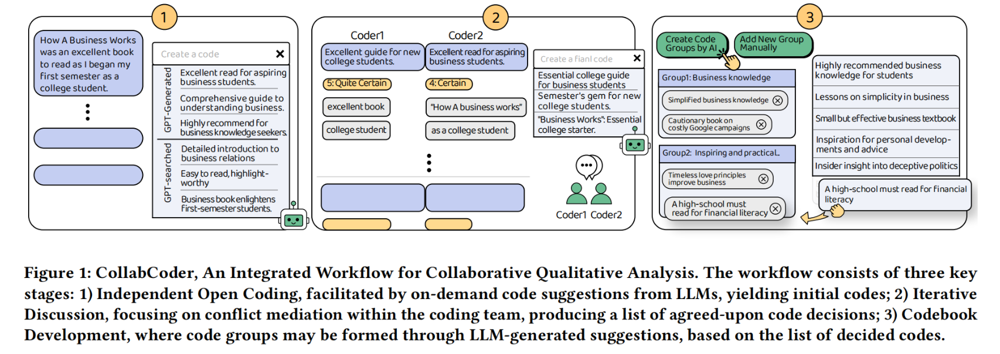

<!--  -->
<!-- <figure style="display: flex; justify-content: center;">
  
  
</figure> -->

<!-- | --- | --- | -->

 

<br/>

[](https://opensource.org/licenses/MIT)
[](https://www.python.org/)
[](https://nodejs.org/en/)
[](https://reactjs.org/)
[](https://www.javascript.com/)
[](https://expressjs.com/)
[](https://github.com/gaojie058/CollabCoder-Project)

# Background

Collaborative is a system integrating the key stages of the CQA process into a one-stop workflow, aiming to lower the bar for adhering to a strict CQA procedure. Whether you are experienced practitioners or novices, you can use CollabCoder to **perform rigorous and comprehensive qualitative analysis** and **seamless data transitions between stages** with minimal effort.

Given that ensuring a rigorous Collaborative Qualitative Analysis (CQA) procedure can be demanding and costly, we introduce **CollabCoder**, a one-stop, end-to-end CQA workflow that integrates **Large Language Models (LLMs)** into key _inductive_ CQA stages aligned with standard CQA protocols: **independent open coding**, **iterative discussions**, and **final codebook creation**.

-   In the **open coding phase**, CollabCoder offers AI-generated code suggestions on demand and records decision-making data (e.g. keywords and certainty) as support for the process.
-   During **discussions**, CollabCoder promotes mutual understanding by sharing coding decision-making data within the coding team and using quantitative metrics to identify coding agreements and disagreements, aiding in consensus-building.
-   In the **code grouping stage**, CollabCoder provides primary code group suggestions, lightening the cognitive load of finalizing the codebook.

Beyond basic functionalities, **CollabCoder integrates GPT** to achieve multiple goals within the workflow:

-   providing automated code suggestions to streamline open codes development;
-   aiding the conversion of open codes into final code decisions; and
-   providing initial versions of code groups, derived from these code decisions, for coders to further refine and adjust.



The effectiveness of CollabCoder has been confirmed by a 16-user evaluation due to its user-friendly design and AI assistance tailored for collaboration.

# Directory

-   [video](#video)
-   [installation](#installation)
    -   [1.0 Prerequisites](#10-prerequisites)
        -   [1.1 install node.js](#11-install-nodejs)
        -   [1.2 set up the Python environment](#12-set-up-the-python-environment)
        -   [1.3 create a cloud database](#13-create-a-cloud-database)
        -   [1.4 get an OpenAI API key](#14-get-an-openai-api-key)
    -   [2.0 Get the CollabCoder Source](#20-get-the-collabcoder-source)
        -   [2.1 Clone the repository](#21-clone-the-repository)
        -   [2.2 Install frontend dependencies](#22-install-frontend-dependencies)
        -   [2.3 Install backend dependencies](#23-install-backend-dependencies)
    -   [3.0 Add .env to backend](#30-add-env-to-backend)
-   [Running](#running)
-   [Building](#building)
-   [Related Papers](#related-papers)
-   [Citations](#citations)

# Video

Here is a video that introduces CollabCoder's motivation and demonstration:

<iframe width="560" height="315" src="https://www.youtube.com/embed/fxZ0_BI0XCA?si=Fu3-nHqVusVQoxWc" title="YouTube video player" frameborder="0" allow="accelerometer; autoplay; clipboard-write; encrypted-media; gyroscope; picture-in-picture; web-share" referrerpolicy="strict-origin-when-cross-origin" allowfullscreen></iframe>

# Installation

Please follow these steps to install CollabCoder.

## 1.0 Prerequisites

### 1.1 install node.js

Before you start setting the frontend environment, ensure node.js is installed. Open a terminal window and type `node -v` and `npm -v` to check whether you have install your Node.js and npm.

### 1.2 set up the Python environment

Given that some APIs require Python, you need to verify and set up the Python environment. Open a terminal window and type ` python --version` to find out if it is already installed and which version is installed.

After checking that everything is correct, run this command:

```
pip install torch transformers sentence-transformers
```

### 1.3 create a cloud database

We highly recommend use the MongoDB Atlas cloud service provided by MongoDB. Follow these steps:

-   Visit [Mongo Cloud](https://www.mongodb.com/cloud/atlas) and create a free database.
    -   Refer to [this video tutorial](https://m.youtube.com/watch?v=xrc7dIO_tXk&list=PL4RCxklHWZ9vmzBP7lybE08CxbIU17PIf&index=1&pp=iAQB) for guidance.
-   get `connection string` which is the URL address of the database.

Note:

-   ensure the database is started
-   ensure the database allows access from your device's IP

Save this URL address and use it later in `DB_URL`.

If you have other options besides MongoDB Atlas, it is ok.

### 1.4 get an OpenAI API key

Get an API key from OpenAI for GPT usage.

Save this API key and use it later in `OPENAI_API_KEY`.

## 2.0 Get the CollabCoder Source

### 2.1 Clone the repository

```
git clone https://github.com/gaojie058/CollabCoder-Project.git
```

### 2.2 Install frontend dependencies

If you finish steps above and check that everything is correct, then you can run this command:

```
# navigate to the client directory
cd .\client\

# install dependencies
npm install
```

Now the frontend environment is set up.

### 2.3 Install backend dependencies

Then you can start setting up the backend environment:

```
# switch to the backend directory
cd .\backend\

# install dependencies
npm install
```

## 3.0 Add .env to backend

Before launching, add a `.env` file in the backend directory by doing the following:

```
NODE_ENV=development
SECRET_KEY='your secret key'
OPENAI_API_KEY='your openAI api key'
PORT = 5000
DB_URI='your mongodb database url'
PYTHON_PATH='python'
```

Explanation of some environment variables:

-   `SECRET_KEY`: the key of jsonwebtoken
-   `PORT`: the port which the server listens on
-   `OPENAI_API_KEY`: the API Key provided by OpenAI which is required when executing a GPT API call.Mentioned in step [1.4](#14-get-an-openai-api-key)

    for example:`sk-xxxxxxxxxxxxxxxxxxxxxxxxx`

-   `DB_URI`: `connection string` mentioned in step [1.3](#13-create-a-cloud-database)

    for example:`mongodb+srv://<username>:<password>@<cluster-url>/<database-name>?retryWrites=true&w=majority`

---

# **Running**

```
cd .\backend\

# Launch the backend in development mode
npm run start
```

```
cd .\client\

# Launch the frontend in development mode
npm run start
```

# Building

For production, build the frontend:

```
cd .\client\

# build the frontend
npm run build
```

# Related Papers

[CollabCoder: A GPT-Powered Workflow for Collaborative Qualitative Analysis](https://arxiv.org/abs/2304.07366)

[CoAIcoder: Examining the Effectiveness of AI-assisted Human-to-Human Collaboration in Qualitative Analysis](https://arxiv.org/abs/2304.05560)

# Citations

@misc{gao2023collabcoder, title={CollabCoder: A GPT-Powered Workflow for Collaborative Qualitative Analysis}, author={Jie Gao and Yuchen Guo and Gionnieve Lim and Tianqin Zhang and Zheng Zhang and Toby Jia-Jun Li and Simon Tangi Perrault}, year={2023}, eprint={2304.07366}, archivePrefix={arXiv}, primaryClass={cs.HC} }

Please contact the author (https://gaojie058.github.io/) for any questions: [gaojie056@gmail.com](mailto:gaojie056@gmail.com).
